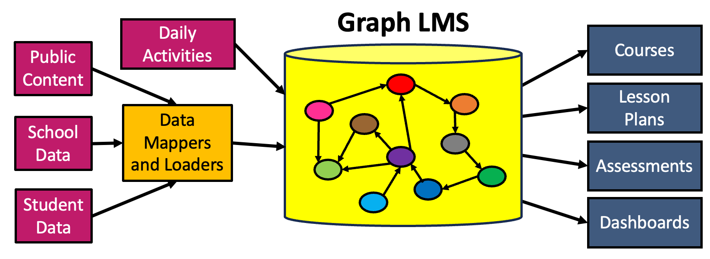

# Graph Learning Management Systems (GLMS)



## Live Documentation Site

**[https://dmccreary.github.io/graph-lms/](https://dmccreary.github.io/graph-lms/)**

## Badges


## About

A research and documentation project exploring graph-based approaches to Learning Management Systems, focusing on AI-driven hyper-personalized learning experiences and sophisticated content recommendation engines.

## Mission

We promote the use of emerging technologies to aid human learning, focusing on how to represent knowledge that can be used to create real-time hyper-personalized learning experiences for everyone.

## Features

- **Graph-Based Data Models**: Comprehensive JSON models representing LMS entities and relationships
- **Interactive Visualizations**: Web-based simulations demonstrating learning graph concepts
- **Architecture Documentation**: Detailed system design for graph-based LMS implementations
- **Concept Frameworks**: Learning trajectories, content graphs, and xAPI integration guides
- **Development Tools**: Python scripts for graph analysis and visualization

## Key Topics

- **Concept Graphs**: Mapping knowledge relationships and prerequisites
- **Content Graphs**: Structuring educational materials and resources
- **Learning Trajectories**: Personalized pathways through educational content
- **Experience API (xAPI)**: Standardized learning activity tracking
- **Learning Record Store (LRS)**: Data storage and analytics
- **Graph-based Integrated Learning Architecture (ILA)**: Modern educational system design

## Documentation

### Key Sections

- **[Concepts](https://dmccreary.github.io/graph-lms/concepts/)** - Learning graphs, trajectories, and xAPI fundamentals
- **[Architecture](https://dmccreary.github.io/graph-lms/arch/)** - Core system designs and components
- **[Data Models](https://dmccreary.github.io/graph-lms/view-data-model/)** - Graph representations with vis.js visualizations
- **[MicroSims](https://dmccreary.github.io/graph-lms/sims/)** - Interactive demonstrations and templates
- **[Prompts](https://dmccreary.github.io/graph-lms/prompts/)** - AI prompts for educational content generation

## Quick Start

### Prerequisites

- Python 3.x
- Conda (recommended) or pip

### Setup

```bash
# Clone the repository
git clone https://github.com/dmccreary/graph-lms.git
cd graph-lms

# Create and activate conda environment
conda create -n mkdocs python=3
conda activate mkdocs

# Install dependencies
pip install mkdocs "mkdocs-material[imaging]"

# Serve locally at http://localhost:8000
mkdocs serve

# Build static site
mkdocs build

# Deploy to GitHub Pages
mkdocs gh-deploy
```

### Python Data Visualization

```bash
# Visualize graph data models with NetworkX
cd src/view-data-model
python view-networkx.py
```

## Project Structure

```
graph-lms/
├── docs/                    # Documentation content
│   ├── concepts/           # Learning concepts and frameworks
│   ├── arch/              # System architecture
│   ├── sims/              # Interactive simulations
│   └── view-data-model/   # Data model visualizations
├── src/                    # Source code and tools
│   ├── view-data-model/   # Graph data and Python scripts
│   └── tools/             # Utility scripts
├── data-models/           # Core data model definitions
└── mkdocs.yml            # Site configuration
```

## Core Values

1. **Universal Education** - The right to education is a fundamental human right
2. **Open Access** - Promoting free education around the world
3. **AI-Driven Learning** - Leveraging advanced AI and ML technologies
4. **Graph-Based Knowledge** - Using knowledge graphs for personalized recommendations
5. **Privacy-First** - Building advanced AI tutors while maintaining student privacy

## Technologies

- **Documentation**: MkDocs with Material theme
- **Visualizations**: [vis.js](https://visjs.org/) for graph rendering, [p5.js](https://p5js.org/) for interactive simulations
- **Data Analysis**: Python with NetworkX and matplotlib
- **Deployment**: GitHub Pages

## License

This project is licensed under the Creative Commons Attribution-NonCommercial-ShareAlike 4.0 International License.

[](https://creativecommons.org/licenses/by-nc-sa/4.0/)

See [LICENSE](./docs/license.md) for full license details.

## Acknowledgments

This project is made possible by the following open source software:

### Core Technologies
- **[MkDocs](https://www.mkdocs.org/)** - Static site generator for project documentation
- **[Material for MkDocs](https://squidfunk.github.io/mkdocs-material/)** - Beautiful and responsive documentation theme
- **[Python](https://www.python.org/)** - Programming language and ecosystem

### Python Libraries
- **[NetworkX](https://networkx.org/)** - Graph analysis and visualization library
- **[Matplotlib](https://matplotlib.org/)** - Plotting and visualization library
- **[PyMdown Extensions](https://facelessuser.github.io/pymdown-extensions/)** - Markdown extensions for enhanced formatting

### Visualization and Media
- **[Vis.js](https://visjs.org/)** - Dynamic network visualization library
- **[p5.js](https://p5js.org/)** - Creative coding platform for interactive simulations
- **[Cairo Graphics](https://www.cairographics.org/)** - 2D graphics library for social card generation

### Standards and Specifications
- **[Experience API (xAPI)](https://xapi.com/)** - Learning technology interoperability standard
- **[Creative Commons](https://creativecommons.org/)** - Open licensing framework

## Contributing

We welcome contributions to improve the documentation and add new educational content. Please feel free to submit issues and pull requests.

## Contact

Created by [Dan McCreary](https://www.linkedin.com/in/danmccreary/) - Feel free to reach out on LinkedIn for questions or collaboration opportunities.

## Related Projects

- [Learning Graphs Website](https://dmccreary.github.io/learning-graphs/)
- [Beginning Python](https://www.coderdojotc.org/python/)

---

*Building the future of personalized learning through graphs, LLM and advanced AI technologies*
