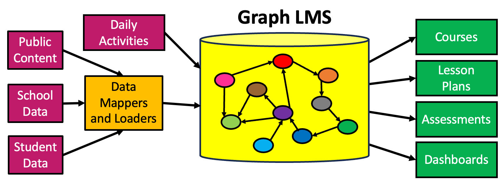

# Graph Learning Management Systems (GLMS)



A research and documentation project exploring graph-based approaches to Learning Management Systems, focusing on AI-driven hyper-personalized learning experiences and sophisticated content recommendation engines.

## 🎯 Mission

We promote the use of emerging technologies to aid human learning, focusing on how to represent knowledge that can be used to create real-time hyper-personalized learning experiences for everyone.

## ✨ Features

- **Graph-Based Data Models**: Comprehensive JSON models representing LMS entities and relationships
- **Interactive Visualizations**: Web-based simulations demonstrating learning graph concepts
- **Architecture Documentation**: Detailed system design for graph-based LMS implementations
- **Concept Frameworks**: Learning trajectories, content graphs, and xAPI integration guides
- **Development Tools**: Python scripts for graph analysis and visualization

## 📖 Documentation

Visit our comprehensive documentation site: **[https://dmccreary.github.io/graph-lms/](https://dmccreary.github.io/graph-lms/)**

### Key Sections

- **[Concepts](https://dmccreary.github.io/graph-lms/concepts/)** - Learning graphs, trajectories, and xAPI fundamentals
- **[Architecture](https://dmccreary.github.io/graph-lms/arch/)** - Core system designs and components
- **[Data Models](https://dmccreary.github.io/graph-lms/view-data-model/)** - Graph representations with vis.js visualizations
- **[MicroSims](https://dmccreary.github.io/graph-lms/sims/)** - Interactive demonstrations and templates
- **[Prompts](https://dmccreary.github.io/graph-lms/prompts/)** - AI prompts for educational content generation

## 🚀 Quick Start

### Prerequisites

- Python 3.7+
- pip package manager

### Setup

```bash
# Clone the repository
git clone https://github.com/dmccreary/graph-lms.git
cd graph-lms

# Install MkDocs and dependencies
pip install mkdocs "mkdocs-material[imaging]"

# Serve locally at http://localhost:8000
mkdocs serve

# Build static site
mkdocs build

# Deploy to GitHub Pages
mkdocs gh-deploy
```

### Python Data Visualization

```bash
# Visualize graph data models with NetworkX
cd src/view-data-model
python view-networkx.py
```

## 🏗️ Project Structure

```
graph-lms/
├── docs/                    # Documentation content
│   ├── concepts/           # Learning concepts and frameworks
│   ├── arch/              # System architecture
│   ├── sims/              # Interactive simulations
│   └── view-data-model/   # Data model visualizations
├── src/                    # Source code and tools
│   ├── view-data-model/   # Graph data and Python scripts
│   └── tools/             # Utility scripts
├── data-models/           # Core data model definitions
└── mkdocs.yml            # Site configuration
```

## 💡 Core Values

1. **Universal Education** - The right to education is a fundamental human right
2. **Open Access** - Promoting free education around the world
3. **AI-Driven Learning** - Leveraging advanced AI and ML technologies
4. **Graph-Based Knowledge** - Using knowledge graphs for personalized recommendations
5. **Privacy-First** - Building advanced AI tutors while maintaining student privacy

## 🔧 Technologies

- **Documentation**: MkDocs with Material theme
- **Visualizations**: [vis.js](https://visjs.org/) for graph rendering, [p5.js](https://p5js.org/) for interactive simulations
- **Data Analysis**: Python with NetworkX and matplotlib
- **Deployment**: GitHub Pages

## 🤝 Contributing

We welcome contributions! Please see our [contact page](https://dmccreary.github.io/graph-lms/contact/) for collaboration opportunities.

## 📄 License

This project is licensed under Creative Commons ShareAlike Attribution Noncommercial. See [LICENSE](./license.md) for details.

## 🙏 Acknowledgments

Special thanks to:
- **[p5.js](https://p5js.org/) team** - For the creative coding platform that powers our interactive learning simulations
- **[vis.js](https://visjs.org/) team** - For the powerful graph visualization library that brings our data models to life
- The open-source community for supporting educational technology initiatives

## 📞 Contact

Created by [Dan McCreary](https://www.linkedin.com/in/danmccreary/) - Feel free to reach out on LinkedIn for questions or collaboration opportunities.

## 🔗 Related Projects

- [Learning Graphs Website](https://dmccreary.github.io/learning-graphs/)
- [Beginning Python](https://www.coderdojotc.org/python/)

---

*Building the future of personalized learning through graphs, LLM and advanced AI technologies* 🚀