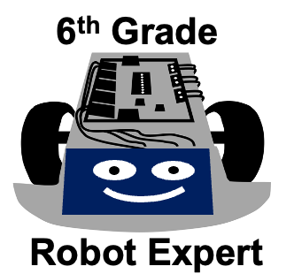
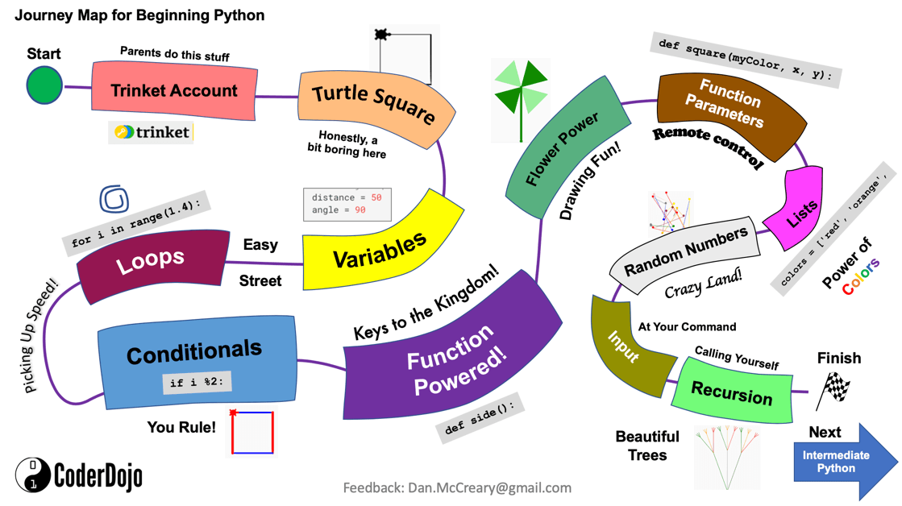

# Glossary of Graph Learning Management System

#### Analytics

The systematic computational analysis of data to discover patterns and insights.

In the graph LMS, analytics are used to monitor student progress, personalize learning paths, and improve educational outcomes.

**Example:** The LMS dashboard provides analytics on student engagement with different learning concepts.

#### Assessment

The evaluation of a student's knowledge, skills, and abilities.

In the graph LMS, assessments are personalized and can adapt in real-time to accurately measure learning progress.

#### Badge

A digital or physical recognition awarded to students upon the completion of a course or achievement of specific learning milestones.

In the graph LMS, badges serve as incentives and markers of accomplishment, representing a student's progress and mastery in particular areas. Badges can be displayed on the student's profile and act as motivators, encouraging further engagement and goal attainment.

In the physical world, many in-person courses provide laptop stickers or iron-on badges for
achieving specific goals.

**Example:** The LMS awards a "Programming Fundamentals" badge to students who complete all modules in an introductory coding course, signifying their understanding of core programming concepts.

* [MicroPython Skill Badge Iron on Patch from Adafruit](https://www.adafruit.com/product/3271)

#### Concept Space

A set of graph nodes and relationships that represents the key concepts
that must be mastered to achieve a learning objective.

In the graph LMS, each course has a set of concepts stored in a graph
database form that describes the concepts for that course.  Concepts
are also stored in a vector store for similarity analysis.

#### Competency-Based Education

An educational model where progress is based on demonstrating competence in specific areas.

In the graph LMS, students advance by proving mastery of competencies rather than time spent on a subject.  This is achieved by monitoring progress and generating real-time simulations
that can monitor progress.

#### Computational Thinking

A problem-solving process that involves breaking down complex problems into manageable parts that can be solved using computational methods.

In the graph LMS, computational thinking skills are fostered through interactive simulations and coding exercises.

**Example:** Students use computational thinking to design algorithms within the LMS simulations.

#### Cognitive Load

The total amount of mental effort being used in working memory.

In the graph LMS, content is tailored to manage cognitive load and prevent student overload.

#### Content Management System (CMS)

A software application that enables users to create, edit, manage, and publish digital content without specialized technical knowledge.

In the graph LMS, a CMS manages educational resources, lesson plans, and multimedia content for courses.

#### Content Space

A set of learning resources that can be customized by the graph LMS in
real-time.

Examples of content include web pages, lesson plans, MicroSims, animations, course content, assessments, formulas, equations and quizzes.

#### Data-Driven Instruction

An approach where teaching is guided by analysis of student data to meet learning needs.

In the graph LMS, data-driven instruction helps educators adjust content and methods for better outcomes.

#### Diamond Age Primer

An inspiration from Neal Stephenson's novel "The Diamond Age," referring to an interactive, adaptive book that provides personalized education.

In the graph LMS, the concept of the Diamond Age Primer influences the creation of hyper-personalized learning experiences.

**Example:** The LMS acts like a modern Diamond Age Primer by adapting lessons in real-time based on student interactions.

#### Directed Graph

A graph where edges have a direction, indicating the relationship flows from one node to another.

In a [learning graph](#learning-graph) is a directed edges shows how a concepts depend on
another concept (a prerequisite concept).

#### Edge

A connection between two nodes in a graph representing the relationship between them.

In a [Learning Graph](#learning-graph), edges depict prerequisites and dependencies between learning concepts.

#### Foundation Concept

A learning concept that is assumed to be known at the start of a course.

Foundation concepts are prerequisites for a course.

Foundation concepts have an out-degree of zero in a learning graph and are
often place on the left side of a [learning graph](#learning-graph).

#### Generative AI

The process of using a [Large Language Model](#large-language-model-llm) to generate
concent (text, image or a sound) from an text prompt.

#### Goal Concept

A concept within a learning graph that has no other concepts that depend on it.

A goal concept has an in-degree of zero (no inbound edges) and are traditionally placed on the right side of a [learning graph](#learning-graph).

#### Graph Database

A type of database that uses graph structures with nodes and edges to represent and store data relationships.

In the graph LMS, a graph database models the connections between courses, concepts, students, and learning resources.

**Example:** The LMS queries the graph database to identify prerequisite concepts for a student's next lesson.

#### Graph Machine Learning

The application of machine learning techniques to graph-structured data to make predictions or discover patterns.

In the graph LMS, graph machine learning predicts student performance and recommends personalized learning paths.

#### GraphRAG

A method that combines graph databases with Retrieval-Augmented Generation to generate personalized content.

In the graph LMS, GraphRAG retrieves relevant concepts from the graph and uses LLMs to generate customized learning materials.

#### Hyper-Personalization

An advanced form of personalization that uses real-time data and AI to deliver highly relevant content to each user.

In the graph LMS, hyper-personalization tailors every aspect of the learning experience to individual student needs.

**Example:** The LMS modifies simulations on-the-fly to match a student's learning style and pace.

#### Journey Map

A visual representation of a student's learning path, highlighting key milestones, interactions, and achievements throughout a course or curriculum.

In the graph LMS, the journey map provides an overview of each student's unique progress, illustrating completed concepts, remaining prerequisites, and upcoming objectives. It serves as both a navigation tool and a motivational guide, helping students visualize their learning trajectory.

**Example:** The LMS journey map shows a student's progression through foundational math concepts, with future topics in algebra and geometry mapped out to encourage goal-setting and clarity on the learning path.

#### Knowledge Management System

A system that organizes, stores, and retrieves knowledge to improve understanding and collaboration.

In the graph LMS, it manages educational content, resources, and learning outcomes across courses.

#### Knowledge Space

A conceptual framework representing all possible knowledge states within a domain.

In the graph LMS, the knowledge space is mapped using nodes and edges to represent concepts and their relationships.

#### LangChain

A framework for developing applications powered by language models.

In the graph LMS, LangChain integrates LLMs to generate real-time, personalized educational content.

#### Large-Language Model (LLM)

An AI model trained on extensive text data to understand and generate human-like language.

In the graph LMS, LLMs create customized explanations, answer questions, and generate simulations.

#### Learning Certification

A formal recognition that a student has achieved a specific level of knowledge or competency in a given subject or skill.

In the graph LMS, learning certifications are awarded upon completion of defined learning objectives, mastery of competencies, or successful assessments. These certifications can be used to track progress and verify skill acquisition.

**Example:** A LMS can grants a learning certification to students who complete all modules in a programming course, demonstrating proficiency in coding basics.

#### Learning Concept

A single atomic concept that is covered within a course of instruction.

Learning concepts have dependencies of other concepts that must be
mastered before a new concept is understood.

A concept that is assumed at the start of a course is called a [Foundation Concept](#foundation-concept) and an end-goal of a course is called a [Goal Concept](#goal-concept)

#### Learning Analytics

The collection and analysis of data about learners to improve education.

In the graph LMS, learning analytics inform decisions on content personalization and instructional strategies.

#### Learning Trajectories

The paths students take through educational content as they progress toward learning objectives.

In the graph LMS, learning trajectories are dynamically adjusted based on student performance and mastery.

**Example:** The LMS reroutes a student's learning trajectory to reinforce a concept they struggled with.

#### Learning Graph

A directed graph of learning concepts where each node in the graph represent
a concept covered in a course and the relationships show the dependency
of the concepts (prerequisites).

See also:

* [Learning Graph](https://dmccreary.github.io/learning-graphs/)
* [Foundation Concept](#foundation-concept)

#### Learning Management System (LMS)

A computer system used to manage the educational process.

LMS systems manage course catalogs, course offerings, course content, course concepts, student enrollments, assessments, grading and certification of completions.

This website suggests that using a graph database is ideal for an AI-based LMS
system that does real-time hyper-personalization of content based on the needs
of the students.

#### Learning Objective

A specific skill or knowledge area that students are interested in or expected to acquire to complete a course.

In the graph LMS, learning objectives guide the creation of personalized learning paths and assessments.

#### Lesson Plan

A detailed guide created by educators outlining the instruction for a class.

In the graph LMS, lesson plans are automatically generated and personalized for each student.

**Example:** The LMS provides a lesson plan that focuses on interactive simulations for visual learners.

#### Machine Learning

A subset of AI that enables systems to learn from data and improve over time without explicit programming.

In the graph LMS, machine learning algorithms personalize content and predict student needs.

#### Markdown

A lightweight markup language with plain text formatting syntax, designed to be easy to read and write. Markdown is widely used to format documents, notes, and web content.

In the graph LMS, Markdown is used to structure content for [microsites](#microsite) and other educational materials, particularly with MkDocs, which converts Markdown files into static websites. Many generative AI tools also output content in Markdown, making it simple to integrate AI-generated content directly into the LMS.

**Example:** The LMS leverages generative AI to produce Markdown lesson plans, which are then formatted and published as microsites using MkDocs.
#### Mastery Learning

An approach where students must achieve a high level of understanding
before moving to the next concept.

In the graph LMS, students progress upon demonstrating mastery,
ensuring solid foundational knowledge.  The LMS can encourage
mastery without boredom by generating interesting content.

#### MicroSim

A stand-alone simulation that is used to explain an educational concept.

MicroSims are designed to be simple so that a large-language model can
generate them or modify them in real-time to meet the needs of a student.

* [MicroSim Website](https://dmccreary.github.io/microsims/)

#### Microsite

A standalone, focused website created using MkDocs, designed to deliver specific content on a narrow topic within the graph LMS.

In the graph LMS, microsites are used to provide detailed, easily accessible resources on particular subjects or courses. They feature a built-in, serverless search function that uses a reverse index loaded into the webpage, allowing users to quickly locate information without relying on an external search engine.

**Example:** A "Graph Algorithms 101" microsite helps students explore algorithm fundamentals, with serverless search enabling quick access to topics like "shortest path" and "clustering."
#### Node

An individual element in a graph representing an entity such as a concept, student, or resource.

In a [learning graph](#learning-graph), nodes are used to represent learning concepts within the knowledge graph.

#### p5.js

A JavaScript library for creative coding, enabling interactive graphics and animations.

In the graph LMS, p5.js is used to create dynamic visualizations and educational simulations
called [MicroSims](#microsim).

#### Personal Learning Environment

A system that provides learners with tools to control and manage their own learning.

In the graph LMS, it empowers students to navigate through content that aligns with their interests and goals.

#### Personalization

The process of customization of content to meet the needs of an individual or group.

In this context, we focus on performing personalization in real-time based
on continual feedback from a students progress.

#### Prerequisite

A concept or course that must be understood before progressing to more advanced material.

In the graph LMS, prerequisites are mapped to ensure students have the necessary foundation before moving forward.

#### Retrieval Augmented Generation (RAG)

A technique that enhances language model outputs by retrieving relevant information from a database.

In the graph LMS, RAG retrieves specific concepts from the graph to generate accurate, personalized content.

#### Real-Time Personalization

The immediate adaptation of content or services based on user interactions and data.

In the graph LMS, learning materials adjust instantly to student inputs and performance.

**Example:** The LMS changes the difficulty level of questions in real-time based on the student's responses.

#### Recommendation System

An algorithm that suggests items or content to users based on analysis of data.

In the graph LMS, recommendation systems propose the next best concepts or resources for a student to explore.

#### Similarity Analysis

The process of comparing data to identify likeness based on certain criteria or features.

In the graph LMS, similarity analysis finds related concepts or resources to enhance personalized learning.

#### Simulations

Interactive programs that imitate real-world processes for learning purposes.

In the graph LMS, simulations help students grasp complex concepts through experiential learning.

**Example:** A physics simulation allows students to adjust variables and observe the effects in real-time.

#### Student Model

A representation of a student's knowledge, skills, and preferences used to personalize learning.

In the graph LMS, the student model is continuously updated based on interactions and assessments.

#### Vector Store

A database that stores vector representations (embeddings) of data for similarity searches.

In the graph LMS, vector stores hold embeddings of concepts to facilitate similarity analysis and content retrieval.

#### vis.js

An open-source JavaScript library for displaying interactive, animated networks.

In the graph LMS, vis.js visualizes the learning graph and concept relationships.

#### xAPI

The Experience API (xAPI) is an advanced learning technology standard that enables the collection and exchange of learning data from various sources, beyond the traditional LMS environment.

[xAPI Standard in Concepts](./concepts/xAPI.md)

#### Zone of Proximal Development (ZPD)

The range of tasks or concepts that a learner can accomplish with guidance but not yet independently. This concept, introduced by Lev Vygotsky, highlights the importance of targeted assistance in learning.

In a learning graph, the ZPD is used to guide real-time personalization by identifying concepts that a student is ready to learn with support. A LMS leverages data analytics and AI to dynamically adjust content, ensuring it remains within the student's ZPD.

**Example:** The LMS identifies that a student struggling with graph traversal is within their ZPD for mastering depth-first search and provides an interactive simulation to bridge the gap.